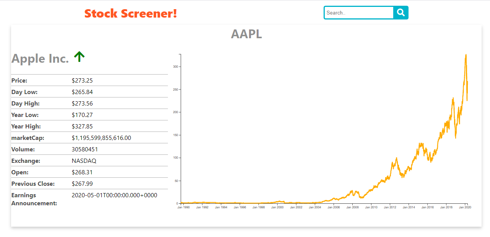

### Stock Screener
This is a stock screener app build with React which consumes an API from https://fmpcloud.io/. With this app you can search daily Financial information about whatever listed company. This application follow the best coding practices like setting-up a code linter, using gitflow, testing business logic, writing good commit messages and an informative README. Also, it uses best practices in React & Redux development, like using a nice folder/files structure with good names and separate different types of components and services.

> This is part of the capstone project part from Microverse Program https://www.notion.so/Catalogue-of-Dog-Clothes-8bf1512b8ab34fa28848beb8ab698a32.

## Live link

* [☝ link]()

## Built With ✨

- JavaScript ECMA6
- Node.js v13.2.0
- React.js V16.13.1
- Redux
- Redux Thunk
- d3.js

To get a local copy up and running follow these simple example steps.

### Prerequisites
* Node.js installed
You will need Node.js up to v8

* System dependencies
Windows/ Mac

### Install
Clone project and run
`npm install`

In order to make the app functional you need to get your personal api key creating an account on https://fmpcloud.io/ and copy and paste your api key after the constant `API_KEY` inside the file `/src/apiKey.js`

## How to contribute and partipate
Fork this repo and submit a PR for review and potential merge to main branch

## Author

👨‍💻 **Christian Salazar**

- Github: [@grifo89](https://github.com/grifo89)
